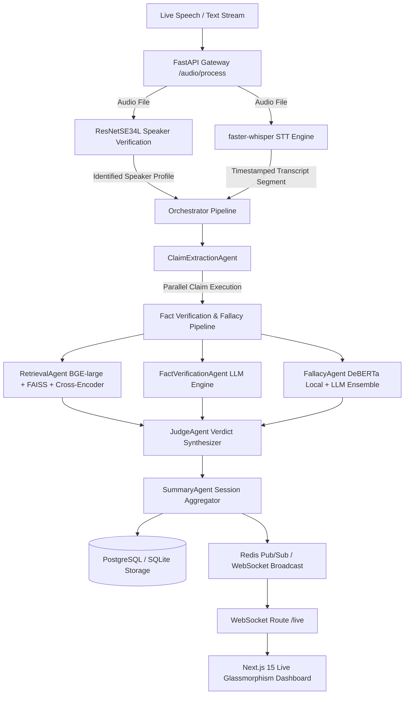

# 🎙️ Debate-AI: Live Multi-Speaker Fact Checker & Fallacy Detection Engine

> **Repository**: [`Kanika0306/debateai`](https://github.com/Kanika0306/debateai)  
> **Status**: Production Ready — 21/21 Integration Tests Passing (100% PASS)  

**Debate-AI** is a real-time debate analysis, fact-checking, and logical fallacy detection platform. It ingests live speech audio or streaming transcript text, identifies speakers using deep neural voice embeddings (`ResNetSE34L`), transcribes speech locally via accelerated Whisper models, extracts checkable claims, retrieves ground-truth evidence from a local RAG vector database (`BAAI/bge-large-en-v1.5` + `FAISS`), classifies logical fallacies via a fine-tuned `DeBERTa-v3` + LLM ensemble with per-class thresholds, resolves final verdicts, and streams structured metrics over native WebSockets to a Next.js 15 glassmorphic live dashboard.

---

## 🏛️ System Architecture



---

## 🤖 Machine Learning Models & AI Inventory

| Component | Model / Framework | Specs & Architecture | Function |
| :--- | :--- | :--- | :--- |
| **Speaker Verification** | `ResNetSE34L` | 34-Layer Deep ResNet + SE + SAP (`baseline_lite_ap.model`) | Generates 512-d embeddings from 16kHz mono audio for speaker enrollment and cosine distance matching. |
| **Speech Recognition** | `faster-whisper` | CTranslate2-accelerated Transformer (`tiny.en` / `base.en`) | Transcribes live speech into text segments with word timestamps and log-prob confidence scores. |
| **Dense Embeddings** | `BAAI/bge-large-en-v1.5` | 1024-dimensional BERT Dense Encoder | Encodes claims and RAG knowledge chunks for FAISS maximum inner product ($IP$) search. |
| **Cross-Encoder Reranker** | `BAAI/bge-reranker-large` | Transformer Joint Query-Chunk Reranker | Scores top-$k$ FAISS candidate chunks against claim text to compute precise relevance rankings. |
| **Fallacy Classifier (Local)** | `microsoft/deberta-v3-base` (Fine-Tuned) | 12-layer Sequence Classifier — 4,689 train / 1,006 val / 1,006 test | Sub-10ms local logical fallacy classification across 11 standardized classes with per-class confidence thresholds. |
| **Claim Extraction Agent** | `GPT-4o-mini` / `Gemini 2.0 Flash` | Few-Shot Prompt Engineered LLM | Filters opinions and extracts checkable factual claims from transcript segments. |
| **Fact Verification Agent** | `GPT-4o-mini` / `Gemini 2.0 Flash` | Multi-Evidence NLI Reasoning Engine | Synthesizes retrieved RAG evidence to assign verdicts (`True`, `False`, `Misleading`, `Unverified`). |
| **Fallback Fallacy LLM** | `GPT-4o-mini` / `Gemini 2.0 Flash` | Prompted 11-Class Taxonomy Classifier | Ensemble fallback when `LocalFallacyAgent` confidence is below per-class threshold. |

---

## 🧠 Logical Fallacy Taxonomy (11 Standardized Classes)

| Class | Description |
| :--- | :--- |
| `ad hominem` | Attacking the opponent's character instead of addressing the argument. |
| `ad populum` | Appealing to popular belief ("Everyone agrees that..."). |
| `appeal to emotion` | Manipulating emotions (fear, pity, anger) rather than presenting evidence. |
| `circular reasoning` | The premise assumes the truth of the conclusion it is trying to prove. |
| `false causality` | Assuming event A caused event B solely because B followed A (*post hoc*). |
| `false dilemma` | Presenting two extreme options when valid alternatives exist. |
| `hasty generalization` | Drawing a broad conclusion from an insufficient sample. |
| `fallacy of relevance` | Introducing irrelevant premises to distract (red herrings). |
| `fallacy of credibility` | Relying on false, unqualified, or biased authority. |
| `equivocation` | Using ambiguous language with double meanings to mislead. |
| `no fallacy` | Logically valid and sound argument. |

---

## 📂 Repository Structure

```text
debate-ai/
├── docker-compose.yml               # Multi-container orchestration (Postgres, Redis, Backend, Frontend)
├── requirements.txt                 # Root Python dependencies
├── .env.example                     # Template for API keys and database params
├── .gitignore                       # Excludes *.safetensors, *.pth, venv, scratch/
│
├── fallacy_classifier/              # DeBERTa-v3 fine-tuning & improvement pipeline
│   ├── config.py                    # 11-class taxonomy, paths, hyperparameters
│   ├── data_prep.py                 # Normalizes fallacies_parsed.parquet + Argotario TSVs → stratified splits
│   ├── train.py                     # DeBERTa-v3-base fine-tuning (adam_epsilon=1e-6, FP32 stable)
│   ├── evaluate.py                  # Classification report + confusion matrix on test set
│   ├── inference.py                 # LocalFallacyAgent — async inference with per-class thresholds
│   ├── error_analysis.py            # Drills into misclassified examples grouped by confusion pair
│   ├── tune_threshold.py            # Sweeps confidence thresholds on val set (global + per-class)
│   ├── augment_weak_classes.py      # Back-translation augmentation for low-recall classes
│   ├── requirements.txt             # Classifier-specific Python deps (transformers, sentencepiece)
│   ├── README.md                    # Full fine-tuning loop documentation
│   └── models/
│       └── fallacy-classifier-v1/  # Saved tokenizer, config, eval reports, confusion matrix
│
├── backend/
│   ├── Dockerfile
│   ├── main.py                      # FastAPI startup hooks and WebSocket /live endpoint
│   ├── api/
│   │   ├── routes.py                # /transcribe, /claims, /verify, /audio/process, /audio/enroll
│   │   └── deps.py                  # Dependency injection (lazy Orchestrator init, Redis)
│   ├── db/
│   │   ├── database.py              # SQLAlchemy engine configuration
│   │   └── models.py                # Schema: sessions, transcripts, claims, verdicts
│   └── services/
│       └── audio_service.py         # Audio resampling, ResNetSE34L speaker verification, Whisper STT
│
├── agents/
│   ├── orchestrator.py              # Master pipeline flow manager
│   ├── schemas.py                   # Pydantic input/output schemas
│   ├── base_agent.py                # Abstract base class with timeout/fallback handling
│   ├── claim_extraction.py          # Factual claim extraction agent
│   ├── retrieval_agent.py           # FAISS dense vector search + BGE cross-encoder reranker
│   ├── fact_verification.py         # Multi-evidence claim verification agent
│   ├── fallacy_agent.py             # DeBERTa local + LLM fallback-to-LLM ensemble
│   ├── judge_agent.py               # Final verdict resolution agent
│   └── summary_agent.py             # Speaker truthfulness scores & session tally aggregator
│
├── frontend/
│   ├── Dockerfile
│   ├── package.json                 # Next.js 15, React 19, Lucide Icons
│   └── src/
│       ├── app/
│       │   ├── globals.css          # Dark slate glassmorphism design system tokens
│       │   ├── layout.tsx           # Root layout with SEO title & meta tags
│       │   └── page.tsx             # Live dashboard assembly page
│       ├── components/
│       │   ├── Header.tsx           # Live connection indicator, latency badge, audio upload
│       │   ├── TranscriptFeed.tsx   # Speaker-colored auto-scrolling transcript feed
│       │   ├── ClaimCard.tsx        # Verdict card with expandable RAG evidence drawer
│       │   ├── FallacyAlert.tsx     # Glowing alert banner for detected fallacies
│       │   ├── SpeakerPanel.tsx     # Speaker trust scores & ResNet match confidence
│       │   ├── SessionStats.tsx     # Session accuracy %, claim counts, latency, verdict distribution
│       │   └── Timeline.tsx         # Chronological claim verdict timeline
│       ├── hooks/
│       │   └── useLiveSession.ts    # Native WebSocket hook with exponential backoff reconnect
│       └── types/
│           └── debate.ts            # Strict TypeScript interfaces matching backend Pydantic schemas
│
└── data/
    ├── processed/                   # CheckThat, FEVER, LIAR, and fallacy dataset parquets
    ├── raw/                         # FEVER, LIAR, Argotario TSVs, VoxCeleb, Common Voice, scraped HTML
    └── vector_db/
        ├── faiss_index/             # Serialized FAISS IndexFlatIP
        └── index_metadata.db        # SQLite: chunk_id → source_url, title, trust_tier
```

---

## 🔁 Fallacy Classifier Fine-Tuning Loop

After the initial `v1` checkpoint, improvements follow a structured 5-step loop:

```bash
python fallacy_classifier/error_analysis.py      # 1. diagnose real misclassified examples
python fallacy_classifier/tune_threshold.py      # 2. calibrate per-class confidence cutoffs
python fallacy_classifier/augment_weak_classes.py --classes "equivocation" "false causality" --multiplier 2
                                                  # 3. back-translate weak-class training data
python fallacy_classifier/train.py               # 4. retrain with augmented splits
python fallacy_classifier/evaluate.py            # 5. verify improvement on held-out test set
```

`LocalFallacyAgent` in `inference.py` accepts per-class confidence thresholds informed by `tune_threshold.py`:

```python
from fallacy_classifier.inference import LocalFallacyAgent

agent = LocalFallacyAgent(threshold={
    "no fallacy": 0.45,
    "equivocation": 0.75,   # weak class — higher bar before trusting local model
    "_default": 0.65,
})
```

---

## ⚡ Quick Start

### 1. Configure Secrets
```bash
cp .env.example .env
# Provide OPENAI_API_KEY or GEMINI_API_KEY
```

### 2. Launch with Docker Compose
```bash
docker-compose up -d
```
Starts:
- **PostgreSQL** (`port 5433 host / 5432 container`)
- **Redis** (`port 6379`)
- **FastAPI Backend** (`http://localhost:8000`)
- **Next.js Dashboard** (`http://localhost:3000`)

---

## 🎙️ REST API Reference

### Audio Endpoints
- `POST /audio/enroll?speaker_name=Speaker_A` — Register speaker voice profile from WAV file.
- `POST /audio/process` — Ingest audio, transcribe via Whisper, identify speaker, run full fact-check & fallacy pipeline, stream results over WebSocket.

### Text Endpoints
- `POST /transcribe` — Process raw text segment through orchestrator.
- `POST /claims` — Extract factual claims from text.
- `POST /verify` — Verify a single claim against RAG evidence.
- `GET /dashboard?session_id=default` — Fetch aggregated session stats & speaker truth scores.

### WebSocket
- `ws://localhost:8000/live?session_id=default` — Native browser WebSocket. Emits structured JSON on every new verdict.

---

## 🧪 Testing

```bash
.venv\Scripts\python.exe -m pytest tests/unit/
```

**Result**: `21 passed in 7.88s — 100% PASS`
