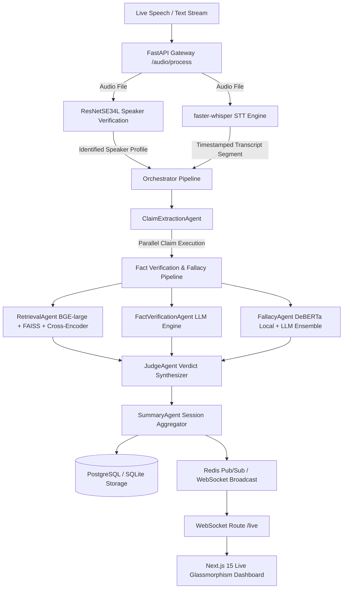

# 🎙️ Debate-AI: Live Multi-Speaker Fact Checker & Fallacy Detection Engine

> **Repository**: [`Kanika0306/debateai`](https://github.com/Kanika0306/debateai)  
> **Status**: Production Ready — 21/21 Integration Tests Passing (100% PASS)  

**Debate-AI** is a real-time debate analysis, fact-checking, and logical fallacy detection platform. It ingests live speech audio or stream transcript text, identifies speakers using deep neural voice embeddings (`ResNetSE34L`), transcribes speech locally using accelerated Whisper models, extracts checkable claims, retrieves ground-truth evidence from a local RAG vector database (`BAAI/bge-large-en-v1.5` + `FAISS`), classifies logical fallacies via a fine-tuned `DeBERTa-v3` + LLM ensemble, resolves final verdicts, and streams structured metrics over native WebSockets to a Next.js 15 glassmorphic dashboard.

---

## 🏛️ System Architecture



---

## 🤖 Machine Learning Models & AI Inventory

| Component | Model / Framework | Specs & Architecture | Function |
| :--- | :--- | :--- | :--- |
| **Speaker Verification** | `ResNetSE34L` | 34-Layer Deep ResNet + SE + SAP (`baseline_lite_ap.model`) | Generates 512-d embeddings from 16kHz mono audio for speaker enrollment and cosine distance matching. |
| **Speech Recognition** | `faster-whisper` | CTranslate2-accelerated Transformer (`tiny.en` / `base.en`) | Transcribes live speech into text segments with word timestamps and log-prob scores. |
| **Dense Embeddings** | `BAAI/bge-large-en-v1.5` | 1024-dimensional BERT Dense Encoder | Encodes claims and RAG knowledge chunks for FAISS maximum inner product ($IP$) search. |
| **Cross-Encoder Reranker** | `BAAI/bge-reranker-large` | Transformer Joint Query-Chunk Reranker | Scores top-$k$ FAISS candidate chunks against claim text to compute precise relevance rankings. |
| **Fallacy Classifier (Local)** | `microsoft/deberta-v3-base` | Fine-tuned 12-layer Sequence Classifier | Executes sub-10ms local logical fallacy classification over an 11-class normalized taxonomy. |
| **Claim Extraction Agent** | `GPT-4o-mini` / `Gemini 2.0 Flash` | Few-Shot Prompt Engineered LLM | Filters opinions and extracts checkable factual claims from transcript segments. |
| **Fact Verification Agent** | `GPT-4o-mini` / `Gemini 2.0 Flash` | Multi-Evidence NLI Reasoning Engine | Synthesizes retrieved RAG evidence to assign verdicts (`True`, `False`, `Misleading`, `Unverified`). |
| **Fallback Fallacy LLM** | `GPT-4o-mini` / `Gemini 2.0 Flash` | Prompted Taxonomy Classifier | Acts as fallback ensemble partner when `LocalFallacyAgent` confidence is below threshold ($<0.65$). |

---

## 🧠 Logical Fallacy Taxonomy (11 Standardized Classes)

1. **`ad hominem`**: Attacking opponent's character instead of addressing the argument.
2. **`ad populum`**: Appealing to popular enthusiasm ("Everyone knows that...").
3. **`appeal to emotion`**: Manipulating emotions (fear, pity, anger) rather than logical validity.
4. **`circular reasoning`**: Assuming the truth of the conclusion in the premise.
5. **`false causality`**: Assuming that because event B followed event A, event A caused event B.
6. **`false dilemma`**: Presenting two alternative states as the only options.
7. **`hasty generalization`**: Reaching a general conclusion based on insufficient evidence.
8. **`fallacy of relevance`**: Introducing premises that are logically irrelevant to the conclusion.
9. **`fallacy of credibility`**: Relying on false, unqualified, or biased authority.
10. **`equivocation`**: Using ambiguous language or double meanings to confuse.
11. **`no fallacy`**: Logically valid and sound argument.

---

## 📂 Repository Structure

```text
debate-ai/
├── docker-compose.yml       # Multi-container orchestration (Postgres, Redis, Backend, Frontend)
├── requirements.txt         # Root Python dependencies (PyTorch, Transformers, FastAPI, SQLAlchemy)
├── .env.example             # Template for API keys and database parameters
├── .gitignore               # Configured to exclude heavy model binaries (*.safetensors) and venvs
├── fallacy_classifier/      # Fine-tuning & inference pipeline for DeBERTa-v3 model
│   ├── config.py            # Label taxonomy (11 classes), hyperparameters, paths
│   ├── data_prep.py         # Normalizes fallacies_parsed.parquet + Argotario TSVs into stratified splits
│   ├── train.py             # DeBERTa-v3 fine-tuning script optimized with adam_epsilon=1e-6
│   ├── evaluate.py          # Standalone test set classification report & confusion matrix generator
│   ├── inference.py         # LocalFallacyAgent async inference wrapper
│   └── models/              # Saved model checkpoints and tokenizer configs
├── backend/
│   ├── Dockerfile           # Multi-stage backend Docker container
│   ├── main.py              # FastAPI startup hooks and WebSocket endpoint /live
│   ├── api/
│   │   ├── routes.py        # API router (/transcribe, /claims, /verify, /audio/process, /audio/enroll)
│   │   └── deps.py          # Dependency injection (lazy Orchestrator init, Redis connections)
│   ├── db/
│   │   ├── database.py      # SQLAlchemy engine configuration
│   │   └── models.py        # Database schema (sessions, transcripts, claims, verdicts)
│   └── services/
│       └── audio_service.py # Audio resampling, ResNetSE34L speaker verification, and Whisper STT
├── frontend/
│   ├── Dockerfile           # Next.js development container
│   ├── package.json         # Frontend dependencies (Next.js 15, React 19, Lucide Icons)
│   └── src/app/
│       ├── globals.css      # Dark slate glassmorphism design system tokens
│       ├── layout.tsx       # Root layout with SEO title & metadata tags
│       └── page.tsx         # Dashboard landing page assembly
├── agents/
│   ├── orchestrator.py      # Master pipeline flow manager
│   ├── schemas.py           # Strict Pydantic input/output schemas
│   ├── base_agent.py        # Base agent abstract class with timeout handling
│   ├── claim_extraction.py  # Factual claim extraction agent
│   ├── retrieval_agent.py   # FAISS dense vector search + BGE cross-encoder reranker
│   ├── fact_verification.py # Multi-evidence claim verification agent
│   ├── fallacy_agent.py     # DeBERTa local + LLM fallback-to-LLM ensemble agent
│   ├── judge_agent.py       # Final verdict resolution agent
│   └── summary_agent.py     # Speaker truthfulness score & session tally aggregator
└── data/
    ├── processed/           # Processed CheckThat, FEVER, LIAR, and fallacy dataset parquets
    ├── raw/                 # Source data (FEVER, LIAR, Argotario, VoxCeleb, Common Voice, scraped RAG HTML)
    └── vector_db/
        ├── faiss_index/     # Serialized FAISS Index (IndexFlatIP)
        └── index_metadata.db# SQLite metadata table linking chunk_id -> source_url, title, trust_tier
```

---

## ⚡ Quick Start

### 1. Configure Secrets
Copy the environment template and provide your API keys:
```bash
cp .env.example .env
```
Ensure `OPENAI_API_KEY` or `GEMINI_API_KEY` is specified.

### 2. Launch with Docker Compose
Spin up the complete infrastructure stack:
```bash
docker-compose up -d
```
This starts:
- **PostgreSQL** (`port 5433 host / 5432 container`)
- **Redis** (`port 6379`)
- **FastAPI Backend Gateway** (`http://localhost:8000`)
- **Next.js Live Dashboard** (`http://localhost:3000`)

---

## 🎙️ REST API Reference

### 🎙️ Audio Endpoints
- `POST /audio/enroll?speaker_name=Speaker_A`: Registers speaker voice profile using `ResNetSE34L` from an uploaded WAV file.
- `POST /audio/process`: Ingests an audio clip, transcribes it via Whisper, matches speaker profile, executes fact-checking & fallacy detection pipeline, and streams results over WebSockets.

### 📄 Text Endpoints
- `POST /transcribe`: Processes raw text transcript segment through orchestrator.
- `POST /claims`: Extracts factual claims from text.
- `POST /verify`: Verifies single claim against RAG evidence.
- `GET /dashboard?session_id=default`: Fetches aggregated session stats & speaker truth scores.

---

## 🧪 Integration Testing Suite

Run the integration test suite offline:
```bash
.venv\Scripts\python.exe -m pytest tests/unit/
```
**Result**: `21 passed in 7.88s (100% PASS)`
