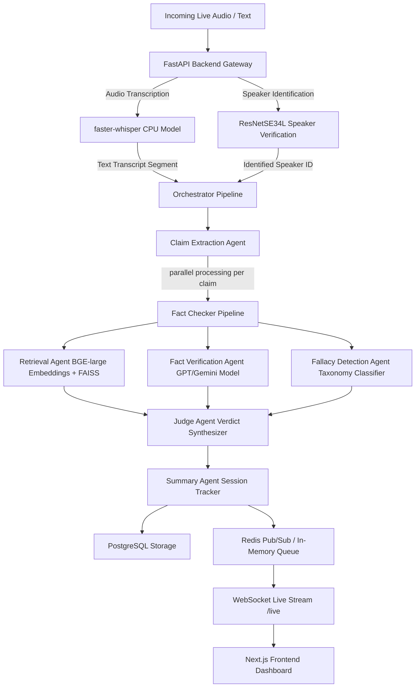

# 🎙️ Debate-AI: Live Fact Checker & Fallacy Detector

Debate-AI is a real-time debate analysis engine. It ingests live audio or text, performs speaker verification, transcribes audio, extracts claims, retrieves supporting context from a local RAG database, validates assertions against facts, detects logical fallacies, and delivers structured verdicts over WebSockets to a live dashboard.

---

## 🏛️ System Architecture



---

## 📂 Repository Layout & Component Map

Here is the exact structural map of the `debate-ai` codebase:

```text
debate-ai/
├── docker-compose.yml       # Multi-container orchestration (Postgres, Redis, Backend, Frontend)
├── requirements.txt         # Main Python dependencies
├── .env.example             # Template for API keys and database configuration
├── walkthrough.md           # Master walkthrough detailing tests and results
├── data/
│   ├── processed/           # Processed & cleaned claim detection parquets (CheckThat, FEVER, LIAR)
│   ├── raw/                 # Source data
│   │   ├── fact_verification/  # FEVER, LIAR, and FEVEROUS datasets
│   │   ├── fallacies/          # Argotario TSVs and Logical Fallacy dataset parquets
│   │   ├── speech/             # Common Voice sample files and configs
│   │   ├── diarization/        # VoxCeleb speech samples (sample_001 to sample_003)
│   │   └── rag_sources/        # Scraped raw HTML (WHO, World Bank, NASA, data.gov.in)
│   └── vector_db/
│       └── faiss_index/     # Serialized FAISS Index and SQLite chunk metadata
├── backend/
│   ├── Dockerfile           # Multi-stage optimized DEV Dockerfile (CPU torch overrides)
│   ├── main.py              # FastAPI app startup and lifecycle hooks
│   ├── api/
│   │   ├── routes.py        # API router (/transcribe, /claims, /verify, /audio/process)
│   │   └── deps.py          # Dependency injection (lazy Orchestrator init, Redis connections)
│   ├── db/
│   │   ├── database.py      # SQLAlchemy engine configuration
│   │   └── models.py        # SQLAlchemy schema (sessions, transcripts, claims, verdicts)
│   └── services/
│       └── audio_service.py # Audio resampling, speaker verification, and transcription helpers
├── frontend/
│   ├── Dockerfile           # Next.js development Dockerfile
│   ├── package.json         # Node.js dependencies
│   └── src/app/
│       ├── page.tsx         # Dashboard landing page
│       └── layout.tsx       # Next.js root layout
├── agents/
│   ├── orchestrator.py      # Wires agents together and manages execution flow
│   ├── schemas.py           # Pydantic input/output schemas matching SQLAlchemy tables
│   ├── base_agent.py        # Abstract agent base class supporting timeout fallbacks
│   ├── claim_extraction.py  # Extracts factual claims using LLM completion
│   ├── retrieval_agent.py   # Queries FAISS index and applies CrossEncoder re-ranking
│   ├── fact_verification.py # Verifies claims against retrieved evidence
│   ├── fallacy_agent.py     # Matches claim to a 13-class normalized fallacy taxonomy
│   ├── judge_agent.py       # Resolves final verdict (True/False/Misleading/Unverified)
│   └── summary_agent.py     # Aggregates speaker metrics and session tallies
└── scripts/
    ├── clean_datasets.py    # Merges claim datasets and parses scraped RAG HTML
    ├── build_rag_index.py   # Encodes RAG chunks into BGE embeddings and builds FAISS index
    ├── fetch_rag_sources.py # Playwright crawler fetching WHO, NASA, and Data.gov.in (with Akamai bypass)
    └── test_speaker_verification.py # Standalone VoxCeleb inference wrapper
```

---

## ⚡ Quick Start

Ensure **Docker Desktop** is running on your system.

### 1. Configure Secrets
Copy the environment template and fill in your keys:
```bash
cp .env.example .env
```
Ensure you provide at least `OPENAI_API_KEY` or `GEMINI_API_KEY` for the LLM agents.

### 2. Launch with Docker Compose
Run the entire stack in detatched mode:
```bash
docker-compose up -d
```
This spins up:
*   **PostgreSQL** (port `5433` on host, internal `5432`)
*   **Redis** (port `6379`)
*   **FastAPI Backend** (port `8000`)
*   **Next.js Frontend** (port `3000`)

---

## 🎙️ Audio Pipeline & Speaker Verification

The audio pipeline runs locally on **CPU** inside the backend container to ensure GPU driver independence:

1.  **Speaker Verification (`ResNetSE34L`)**:
    *   Uses Clova AI's pre-trained ResNet model (`scratch/baseline_lite_ap.model`).
    *   Resamples uploaded audio to `16,000Hz mono`.
    *   Generates a `512-dimensional embedding` for the speech segment.
    *   Enrolls reference speaker files via `POST /audio/enroll`.
    *   Compares incoming segment embeddings using cosine similarity. If the score matches an enrolled profile above the `0.40 threshold`, the speaker identity is resolved; otherwise, it falls back to `unknown`.
2.  **Transcription (`faster-whisper`)**:
    *   Loads the `tiny.en` Whisper model.
    *   Performs fast, local transcription.
3.  **Pipeline Routing**:
    *   The transcribed segment and identified speaker profile are passed to `Orchestrator.process_segment()`.
    *   Claims are extracted, verified, and fallacies detected.
    *   Live results are stored in Postgres and streamed to the websocket clients (`/live`).

---

## 🔍 REST API Reference

### 🎙️ Audio endpoints
#### `POST /audio/enroll`
Registers a speaker's voice print.
*   **Parameters**: `speaker_name` (query string), `file` (multipart WAV audio file)
*   **Response**: `{"status": "success", "message": "Enrolled speaker [Name]"}`

#### `POST /audio/process`
Ingests an audio segment, transcribes it, identifies the speaker, and runs full fact-checking.
*   **Parameters**: `session_id` (multipart Form, default: "default"), `file` (multipart WAV audio file)
*   **Response**:
    ```json
    {
      "status": "success",
      "speaker": "Speaker_B",
      "transcription": "No, it's not for me...",
      "pipeline_output": { ... }
    }
    ```

### 📄 Text endpoints
#### `POST /transcribe`
Processes a textual transcript segment through the fact-checker.
*   **Body**: `{"segment_text": "...", "speaker": "...", "session_id": "..."}`

#### `POST /claims`
Extracts checkable claims from text.
*   **Body**: `{"segment_text": "...", "speaker": "..."}`

#### `POST /verify`
Verifies a single claim against specific evidence.

#### `GET /dashboard`
Aggregates summary statistics for a given session.

---

## 🧪 Testing & Validation

### 1. Run Unit Tests
Unit tests run entirely offline with mocked ML models and external APIs.
```bash
.venv\Scripts\python.exe -m pytest tests/
```
All **21/21 tests** must pass.

### 2. Manual Audio Endpoint Check
You can test the audio process route using the provided test script:
```bash
.venv\Scripts\python.exe scratch/test_audio_endpoint.py
```
This uploads `sample_002_verif.wav` to the Docker API, verifying transcription text and speaker match outputs.
